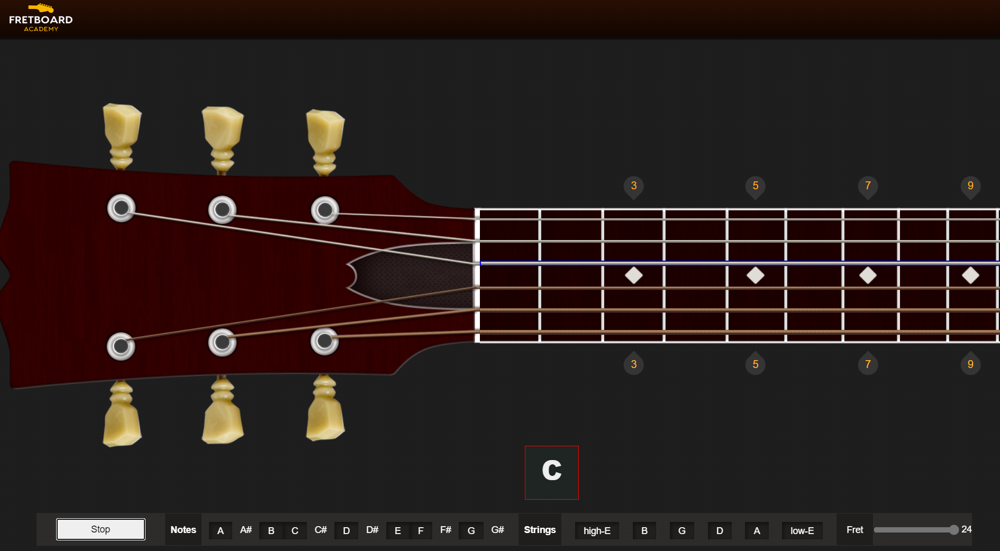

# Fretboard Academy

Welcome to the Fretboard Academy! This web application is designed to help you master the guitar fretboard by providing an interactive and engaging learning experience. This project is built with Vue.js and was inspired by the UI of [FretMap](https://github.com/thathurtabit/FretMap) by ThatHurtABit.

## Features

- Interactive and visual representation of the guitar fretboard.
- Learn the names of notes on the fretboard.
- Practice identifying notes in different positions.
- Responsive design for desktop and mobile devices.



## Getting Started

Follow these instructions to get the project up and running on your local machine.

### Prerequisites

- Node.js and npm (Node Package Manager) installed.

### Installation

1. Clone the repository to your local machine.

```bash
git clone git@github.com:pouyaSamie/fretboard-memorization.git
```

2. Navigate to the project directory.

```bash
cd fretboard-memorization
```

3. Install the project dependencies.

```bash
yarn install
```

### Compiles and hot-reloads for development
```bash
yarn serve
```
### Contributing
Contributions are welcome! If you'd like to contribute to this project, please follow these guidelines:

- Fork the repository.

- Create a new branch for your feature or bug fix.

- Make your changes and test them thoroughly.

- Create a pull request with a clear description of your changes.

### License

This project is licensed under the MIT License

### Acknowledgments

Inspired by [FretMap](https://github.com/thathurtabit/FretMap) by ThatHurtABit.
Built with Vue.js.

### Contact
If you have any questions or suggestions, feel free to contact me.

Happy guitar fretboard memorization!
